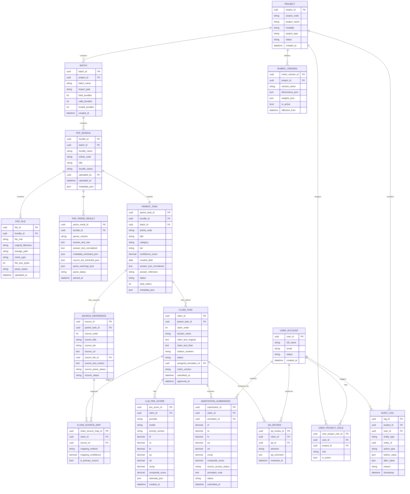

# 01. ERD MVP and Extensible — PDF-native Import

**Owner:** Phạm Đan Kha  
**Phiên bản:** v0.4  
**Mục tiêu:** ERD cho MVP khi input chính thức là PDF bundle.

---

## 1. Nguyên tắc thiết kế

- Input chính của MVP là PDF bundle.
- CSV/JSON không còn là import chính.
- Sau upload, hệ thống parse PDF thành dữ liệu nội bộ có cấu trúc.
- Export cuối là CSV claim-level.
- Mọi claim/export phải trace được về file PDF gốc.
- MVP build text/PDF only nhưng data model vẫn giữ hướng mở rộng multi-project/multi-modality.

---

## 2. Mermaid ERD

---

## 3. Entity summary

| Entity | Build MVP? | Mục đích |
|---|---:|---|
| PROJECT | Có | Project Vivipedia, giữ hướng multi-project |
| BATCH | Có | Một lần upload nhiều PDF bundle |
| PDF_BUNDLE | Có | Một bài input gồm nhiều PDF |
| PDF_FILE | Có | Lưu từng PDF: answer, source ref, source content |
| PDF_PARSE_RESULT | Có | Kết quả parse/normalize từ PDF |
| PARENT_TASK | Có | Bài/answer sau parse |
| SOURCE_REFERENCE | Có | Source order/title/tier/text/url |
| CLAIM_TASK | Có | Đơn vị annotation |
| CLAIM_SOURCE_MAP | Có | Map claim-source |
| LLM_PRE_SCORE | Có | Điểm LLM gợi ý |
| ANNOTATION_SUBMISSION | Có | Điểm annotator |
| QA_REVIEW | Có | Approve/Return |
| RUBRIC_VERSION | Có đơn giản | 6 tiêu chí fixed v1 |
| USER_ACCOUNT | Có | User |
| USER_PROJECT_ROLE | Có | RBAC |
| AUDIT_LOG | Có tối thiểu | Trace action chính |

---

## 4. Design notes

### Vì sao cần PDF_BUNDLE?

Vì một article input không còn là một row CSV mà là một nhóm file PDF. `PDF_BUNDLE` cho phép hệ thống quản lý một đơn vị input hoàn chỉnh.

### Vì sao cần PDF_FILE?

Để lưu từng file trong bundle:
- `answer_pdf`
- `source_ref_pdf`
- `source_content_pdf`

### Vì sao cần PDF_PARSE_RESULT?

Để tách dữ liệu raw khỏi dữ liệu normalized:
- `answer_text_raw`: text parse thô.
- `answer_text_normalized`: text đã clean dùng cho claim extraction.
- `source_list_extracted_json`: danh sách source parse từ PDF ref.
- `parse_warnings_json`: warning về noise, thiếu URL, OCR required.

### Vì sao vẫn cần internal normalization?

Dù không export/import CSV/JSON, hệ thống vẫn cần dữ liệu có cấu trúc trong database để chạy claim extraction, scoring, review, QA và export.
