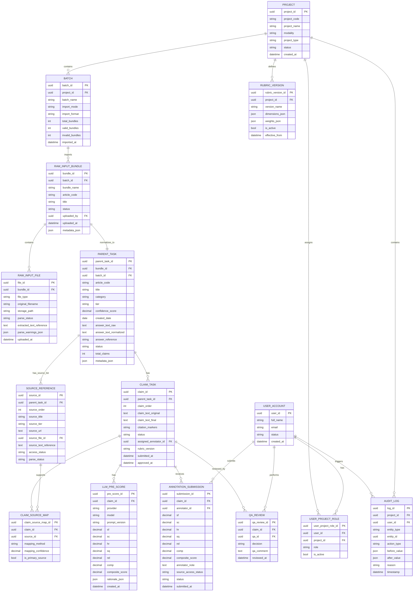

# 01. ERD MVP and Extensible — PDF-ready Data Model

**Owner:** Phạm Đan Kha  
**Phiên bản:** v0.3  
**Mục tiêu:** Thiết kế ERD cho MVP text/Vivipedia, có bổ sung raw PDF input bundle để trace được từ output CSV về PDF gốc.

---

## 1. Nguyên tắc thiết kế

- MVP chỉ build text/Vivipedia.
- Input thực tế hiện tại là PDF bundle.
- Platform MVP có thể import normalized CSV/JSON, nhưng data model vẫn cần lưu được raw file reference.
- Một Project có nhiều Batch.
- Một Batch có nhiều Raw Input Bundle.
- Một Raw Input Bundle gồm nhiều Raw Input File.
- Một Raw Input Bundle tạo ra một Parent Task.
- Một Parent Task sinh nhiều Claim Task.
- Một Claim Task có một hoặc nhiều Source Reference.
- Một Claim Task có LLM Pre-score, Annotator Submission, và QA Review.
- Export CSV claim-level phải trace ngược được về `bundle_id`, `article_code`, và file PDF gốc.

---

## 2. Mermaid ERD

---

## 3. Entity summary

| Entity | Build MVP? | Mục đích |
|---|---:|---|
| PROJECT | Có | Lưu project Vivipedia, giữ khả năng multi-project |
| BATCH | Có | Một lần import data |
| RAW_INPUT_BUNDLE | Có | Một bộ PDF input gốc |
| RAW_INPUT_FILE | Có / tối thiểu metadata | Lưu từng PDF trong bundle |
| PARENT_TASK | Có | Một bài/câu trả lời gốc sau normalize |
| SOURCE_REFERENCE | Có | Danh sách nguồn được đánh số |
| CLAIM_TASK | Có | Đơn vị annotation chính |
| CLAIM_SOURCE_MAP | Có | Map claim với source order/source id |
| LLM_PRE_SCORE | Có | Điểm LLM gợi ý |
| ANNOTATION_SUBMISSION | Có | Điểm annotator |
| QA_REVIEW | Có | Approve/Return |
| RUBRIC_VERSION | Có, đơn giản | 6 tiêu chí fixed v1 |
| USER_ACCOUNT | Có | User hệ thống |
| USER_PROJECT_ROLE | Có | RBAC cơ bản |
| AUDIT_LOG | Có, tối thiểu | Log action chính |

---

## 4. Extensibility notes

Để hỗ trợ audio/image/table sau MVP, giữ các field sau:

| Field | Lý do |
|---|---|
| `project.modality` | text / image / audio / table / video |
| `project.project_type` | vivipedia_claim_review, image_region_review, audio_segment_review |
| `raw_input_file.file_type` | answer_pdf, source_ref_pdf, source_content_pdf, image, audio, table |
| `parent_task.metadata_json` | Lưu metadata đặc thù theo modality |
| `source_reference.source_text_reference` | Có thể thay bằng transcript, OCR text, table extract |
| `claim_task.claim_text_*` | Với image/audio có thể mở rộng thành annotation unit text/label |
| `claim_source_map.mapping_method` | citation_marker, llm_mapping, manual_mapping |
| `rubric_version.dimensions_json` | Mỗi project/modality có rubric khác nhau |

---

## 5. Quyết định thiết kế quan trọng

| ID | Decision | Lý do |
|---|---|---|
| ERD-D01 | Thêm `RAW_INPUT_BUNDLE` và `RAW_INPUT_FILE` | Trace được từ export về PDF gốc |
| ERD-D02 | Tách `SOURCE_REFERENCE` khỏi `CLAIM_TASK` | Một source có thể support nhiều claim |
| ERD-D03 | Dùng `CLAIM_SOURCE_MAP` | Một claim có thể map nhiều source |
| ERD-D04 | Không lặp full `answer_text` trong export claim-level | Giảm kích thước CSV, dùng `answer_reference` |
| ERD-D05 | Lưu cả `answer_text_raw` và `answer_text_normalized` | Debug parser và phục vụ LLM |
| ERD-D06 | QA MVP chỉ lưu decision/comment | Theo scope 4 tuần Approve/Return |
