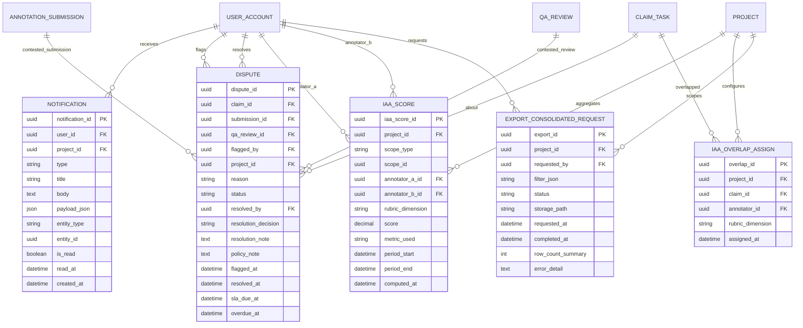

# 09. ERD Extensions — Sprint 3 (Notification · IAA · Dispute)

**Owner:** Phạm Đan Kha
**Phiên bản:** v0.2 (Sprint 3 draft)
**Trạng thái:** Draft — Tuần 1
**Phạm vi:** Bổ sung 3 entity mới vào ERD `01_ERD_MVP_and_Extensible.md` (v0.6). Không đụng các entity Sprint 1–2.
**Quyết định chốt tham chiếu:** `docs/03_ba/tuyet/04_Open_Questions...md` §6 (DEC-S3-01..06)

---

## 1. Nguyên tắc thiết kế (bổ sung)

- 3 entity mới **không thay đổi** schema Sprint 1–2; chỉ thêm quan hệ (FK) khi cần (vd `dispute.claim_id` → `CLAIM_TASK`).
- **Dispute record immutable** — INSERT-only (giống `AUDIT_LOG` ở BR-10.1). Ghi nhận qua trigger DB `REVOKE UPDATE, DELETE` giống audit_log (xem `infra/postgres/init.sql`).
- **Notification scope per user** — mỗi row notification thuộc về 1 user, an toàn khi RBAC sau này (mỗi user chỉ xem của mình).
- **IAA là số tính sẵn (precomputed)** — không tính realtime; job chạy batch khi có event (submit/approve). Cấu hình theo project.
- **Metric khuyến nghị cho rubric 6-dim continuous** (DEC-S3-01): **Krippendorff's Alpha**. Lưu `metric_used` để còn đổi metric sau này (Cohen/Fleiss/ICC) mà không vỡ history.
- **Dispute MVP flow** (DEC-S3-02): QA flag → Admin resolve. `policy_analyst` là role dự phòng cho luồng Full (chưa build UI).
- **Export consolidated** (DEC-S3-03): 1 file XLSX 6 sheet — định nghĩa sheet ở artifact riêng `#11_…_Export_Schema_Consolidated.md`, ERD chỉ chứa bảng `EXPORT_CONSOLIDATED_REQUEST` để track job.

---

## 2. Mermaid ERD (extension)

---

## 3. Quan hệ (FK) — gọi lại để rõ

| From | Column | → | To.column |
|---|---|---|---|
| `NOTIFICATION.user_id` | FK | → | `USER_ACCOUNT.user_id` |
| `NOTIFICATION.project_id` | FK nullable | → | `PROJECT.project_id` |
| `DISPUTE.claim_id` | FK | → | `CLAIM_TASK.claim_id` |
| `DISPUTE.submission_id` | FK nullable | → | `ANNOTATION_SUBMISSION.submission_id` (submission đang bị dispute) |
| `DISPUTE.qa_review_id` | FK nullable | → | `QA_REVIEW.qa_review_id` (review lần 2 bị reject) |
| `DISPUTE.flagged_by` | FK | → | `USER_ACCOUNT.user_id` (QA flag) |
| `DISPUTE.resolved_by` | FK nullable | → | `USER_ACCOUNT.user_id` (Admin/Policy resolve) |
| `DISPUTE.project_id` | FK | → | `PROJECT.project_id` (cho query dashboard) |
| `IAA_OVERLAP_ASSIGN.project_id` | FK | → | `PROJECT.project_id` |
| `IAA_OVERLAP_ASSIGN.claim_id` | FK | → | `CLAIM_TASK.claim_id` |
| `IAA_OVERLAP_ASSIGN.annotator_id` | FK | → | `USER_ACCOUNT.user_id` |
| `IAA_SCORE.project_id` | FK | → | `PROJECT.project_id` |
| `IAA_SCORE.annotator_a_id` / `annotator_b_id` | FK | → | `USER_ACCOUNT.user_id` |
| `EXPORT_CONSOLIDATED_REQUEST.project_id` | FK | → | `PROJECT.project_id` |
| `EXPORT_CONSOLIDATED_REQUEST.requested_by` | FK | → | `USER_ACCOUNT.user_id` |

---

## 4. Lý do tách NOTIFICATION vs AUDIT_LOG

| | NOTIFICATION | AUDIT_LOG |
|---|---|---|
| Mục đích | Thông báo user có việc cần làm | Trace nghiệp vụ (BR-10) |
| Hướng ghi | Per user (recipient) | Per project (global) |
| Có thể xóa | Có — user "mark read" / cleanup cũ | **Không** (immutable) |
| Scope | Notification surface (UI) | Compliance / forensic |

→ Không gộp. Tách 2 bảng để RBAC + lifecycle khác nhau.

## 5. Lý do tách IAA_OVERLAP_ASSIGN vs CLAIM_TASK

`IAA_OVERLAP_ASSIGN` chỉ là **cầu nối n-N**: project nào, claim nào, annotator nào, rubric dim nào.
Không nhồi vào `CLAIM_TASK` vì:
- 1 claim có thể overlap nhiều annotator × nhiều dim → sparse
- Không muốn `CLAIM_TASK.assigned_annotator_id` chuyển thành mảng (vỡ backward-compat Sprint 1–2)
- IAA job query theo project + period; tách bảng giúp index/partition tốt hơn

## 6. Lý do EXPORT_CONSOLIDATED_REQUEST tách bảng

- 1 file XLSX build async, nặng → cần track status (queued/running/done/failed)
- Lưu `filter_json` để tái tạo lại export (audit); `row_count_summary` để verify nhanh không cần mở file.
- `storage_path` → file XLSX nằm trong MinIO/S3 (qua `FileStorage` interface — xem `04-storage.md`).

---

## 7. Entity summary (cập nhật bảng §3 của `01_ERD_MVP_and_Extensible.md`)

| Entity | Build MVP? | Mục đích |
|---|---:|---|
| NOTIFICATION | Sprint 3 | In-app notification per user (polling 10s) |
| DISPUTE | Sprint 3 | QA flag → Admin resolve; immutable record |
| IAA_OVERLAP_ASSIGN | Sprint 3 | Mapping claim × annotator × rubric dim |
| IAA_SCORE | Sprint 3 | Precomputed IAA per (scope, dim, period) |
| EXPORT_CONSOLIDATED_REQUEST | Sprint 3 | Track async export XLSX job |

---

## 8. ✅ Đã chốt (23/06/2026)

| ID | Quyết định | Chi tiết |
|---|---|---|
| **Immutable trigger** | DISPUTE table: DB trigger `REVOKE UPDATE, DELETE` (giống AUDIT_LOG) | VR-DISP-014; app-level chỉ cho phép status transition + resolved_by/at |
| **Cleanup policy** | NOTIFICATION: unread 90 ngày, read 30 ngày | VR-NOTIF-009; cron auto-cleanup |

## 9. DB Constraint DDL gợi ý (cho Backend / Postgres Admin)

Các constraint dưới đây mirror các VR trong artifact #12. Backend nên tạo migration riêng trong Sprint 4.

### 9.1 UNIQUE constraints

| Entity | Constraint | Mục đích |
|---|---|---|
| `NOTIFICATION` | `UNIQUE (user_id, entity_type, entity_id, type)` | Chống duplicate (VR-NOTIF-005) |
| `IAA_OVERLAP_ASSIGN` | `UNIQUE (claim_id, annotator_id, rubric_dimension)` | 1 annotator 1 dim / claim (DD §6.3) |
| `IAA_SCORE` | `UNIQUE (project_id, scope_type, scope_id, rubric_dimension, period_start, period_end)` | UPSERT idempotent (EC-IAA-009) |
| `DISPUTE` | `UNIQUE (claim_id) WHERE status NOT IN ('dispute_resolved_approved', 'dispute_resolved_re_annotation', 'dispute_overdue')` | Chỉ 1 dispute active / claim (VR-DISP-005) |

### 9.2 CHECK constraints

| Entity | Constraint | VR ref |
|---|---|---|
| `DISPUTE.status` | `CHECK (status IN ('disputed','dispute_in_review','dispute_resolved_approved','dispute_resolved_re_annotation','dispute_overdue'))` | VR-DISP-011 |
| `DISPUTE.reason` | `CHECK (reason IN ('guideline_unclear','unresolved_score_disagreement','extraction_mapping_error','repeated_error_pattern','other'))` | VR-DISP-004 |
| `DISPUTE.resolution_decision` | `CHECK (resolution_decision IS NULL OR resolution_decision IN ('approved','re_annotation_required'))` | VR-DISP-008 |
| `IAA_SCORE.score` | `CHECK (score >= 0.00 AND score <= 1.00)` | VR-IAA-005 |
| `IAA_SCORE.period_end` | `CHECK (period_end > period_start)` | VR-IAA-006 |
| `IAA_SCORE.scope_type` | `CHECK (scope_type IN ('project','pair','annotator','dimension'))` | DD §6.4.a |
| `NOTIFICATION.type` | `CHECK (type IN ('task_assigned','task_returned','dispute_created','dispute_resolved','llm_pre_scoring_done','llm_pre_scoring_failed','rubric_published','export_done','sla_approaching','dispute_overdue'))` | VR-NOTIF-002 |
| `EXPORT_CONSOLIDATED_REQUEST.status` | `CHECK (status IN ('queued','running','done','failed'))` | VR-EXP-CONS-001/008/009 |

### 9.3 FK ON DELETE behavior

| FK | ON DELETE | Lý do |
|---|---|---|
| Tất cả FK → `USER_ACCOUNT` | `RESTRICT` hoặc `SET NULL` (tùy field required) | Không cascade xóa user; giữ audit trace |
| FK → `PROJECT` | `RESTRICT` | Không xóa project khi còn dữ liệu |
| FK → `CLAIM_TASK` | `CASCADE` (cho DISPUTE, IAA_OVERLAP_ASSIGN) | Xóa claim → xóa dispute/overlap liên quan |
| FK → `ANNOTATION_SUBMISSION`, `QA_REVIEW` (nullable) | `SET NULL` | Dispute vẫn tồn tại dù submission/review bị xóa |

### 9.4 Trigger DB

| Trigger | Entity | Chi tiết |
|---|---|---|
| `trg_dispute_immutable` | `DISPUTE` | `REVOKE UPDATE, DELETE` (giống `AUDIT_LOG`); app-level bypass qua function `resolve_dispute()` với `SECURITY DEFINER` |
| `trg_dispute_overdue` | `DISPUTE` | Cron hoặc pg_cron: `UPDATE status = 'dispute_overdue', overdue_at = now() WHERE status IN ('disputed','dispute_in_review') AND now() > sla_due_at` |

---

## 10. Mở / chưa chốt (cần Q&A / Sprint 4)

- `policy_analyst` user role — hiện chưa có trong `USER_PROJECT_ROLE.role` enum (chỉ `admin/annotator/qa`). Có chốt bổ sung trong Sprint 3 hay giữ "Admin đóng vai Policy" tạm thời? (DEC-S3-06 chỉ nói UI MVP Admin resolve; role riêng hoãn)
- `NOTIFICATION.type` enum: liệt kê chi tiết ở artifact #10 — đã xác nhận.
- `DISPUTE.reason`: enum cố định 5 options → đã chốt C01.
- `IAA_SCORE.scope_type`: `project` / `pair` / `dimension` / `global`? Đề xuất project + dimension (composite = "overall"); pair deprecate để tránh O(N²).
