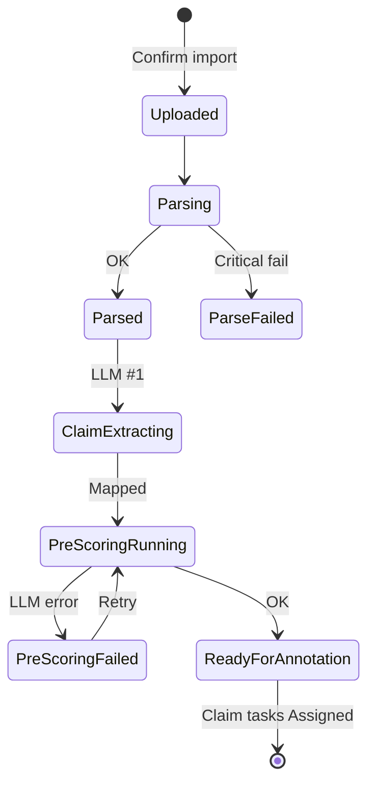

# VSF AI Annotation Platform — MVP User Stories

**Owner:** Quang  
**Phiên bản:** 1.2 (PDF-native)  
**Ngày:** 09/06/2026  
**Baseline:** `VSF_AI_Annotation_Platform_Scope_Breakdown.md` v1.2 · `docs/03_ba/dan/` · Báo cáo PM §6

---

## 1. Phân quyền & Vai trò (RBAC Baseline)

- **Admin:** Tạo project, cấu hình LLM, import PDF bundle, export, xem audit log, gán Annotator/QA trong project (**không** User Management UI đầy đủ).
- **Annotator:** Chỉ xem và làm task được giao (OQ-008).
- **QA Specialist:** Review **100%** task `Submitted` trong project được giao; Approve/Return; export CSV trong project được giao (§6.5).

---

<<<<<<< HEAD
## 2. Luồng Import PDF Bundle (Import Flow)

### US-01: Import PDF Bundle thủ công (Admin)
- **Mô tả:**
  - **As an** Admin,
  - **I want to** upload a PDF bundle containing the Vivipedia answer, source reference list, and source content PDFs,
  - **So that** the system can ingest the real portal output and prepare it for the annotation pipeline.
- **Tiêu chí nghiệm thu (Acceptance Criteria):**
  1. Giao diện Setup/Import cho phép Admin kéo thả hoặc chọn nhiều file PDF từ máy tính.
  2. Admin có thể gán file role cho từng file: đúng 1 `answer_pdf`, đúng 1 `source_ref_pdf`, và ít nhất 1 `source_content_pdf`.
  3. Hệ thống validate bundle theo PDF-native schema:
     - Block nếu thiếu/trùng `answer_pdf` hoặc `source_ref_pdf`, không có `source_content_pdf`, file không phải PDF, file corrupt, hoặc vượt max size.
     - Warning nếu `source_url` không parse được nhưng vẫn có `source_order`, `source_title`, `source_tier` và source text đủ dùng.
  4. Hệ thống hiển thị parse preview gồm metadata bài, normalized answer text summary, source list, source content mapping và parse warnings để Admin xác nhận trước khi import.
  5. Sau khi Admin bấm "Confirm Import", hệ thống tự động tạo Batch, PDF Bundle, Parent Task và kích hoạt pipeline nền.
  6. Nhật ký hệ thống (Audit Log) ghi nhận hành động: `import` (Admin ID, bundle/file names, Batch ID, Timestamp).

### US-02: Tự động tách Claim (Claim Extraction) & Tạo Task (System)
- **Mô tả:**
  - **As an** Admin/System,
  - **I want the system to** automatically split parsed `answer_text_normalized` into separate claims and generate tasks,
  - **So that** the data is structured at a granular claim level for annotators to review.
- **Tiêu chí nghiệm thu (Acceptance Criteria):**
  1. Ngay sau khi PDF bundle được import và parse thành công, hệ thống tự động kích hoạt tiến trình tách claim từ `answer_text_normalized`.
  2. Mỗi claim sau khi tách được lưu trữ dưới dạng một `Claim Task` độc lập trong cơ sở dữ liệu.
  3. Hệ thống phải đảm bảo giữ nguyên thứ tự xuất hiện gốc của các claim trong câu trả lời (`answer_text_normalized`) thông qua chỉ số thứ tự (`claim_order`).
  4. Các `Claim Task` này phải liên kết trực tiếp với Parent Task, Answer PDF gốc và các source candidate parse từ Source Reference/Source Content PDF.
  5. **Quy tắc kiểm tra nguồn (Source Checking Rule):**
     - Nếu một claim không có source candidate nào map được từ citation marker/source order, hệ thống tự động chuyển trạng thái của task đó thành `Source Mapping Required` và tạm thời **không** đưa vào hàng đợi làm việc (queue) của Annotator.

### US-03: Gọi LLM Pre-scoring lấy điểm gợi ý (System)
- **Mô tả:**
  - **As an** Admin/System,
  - **I want the system to** query a designated LLM provider to pre-score each claim across 6 dimensions,
  - **So that** the annotators have a baseline suggestion ("AI Draft") when they start working.
- **Tiêu chí nghiệm thu (Acceptance Criteria):**
  1. Với mỗi `Claim Task` có nguồn hợp lệ, hệ thống tự động gọi API tới 1 LLM provider cố định đã cấu hình trong dự án.
  2. Gửi request kèm theo prompt template, claim text, answer context và source text/URL nếu có để LLM đánh giá điểm cho 6 dimension của Vivipedia.
  3. Hệ thống lưu trữ các điểm số pre-score này vào cơ sở dữ liệu làm **baseline bất biến** (không cho phép bất kỳ ai chỉnh sửa bản ghi baseline này).
  4. Hiển thị điểm số gợi ý này trên màn hình gán nhãn dưới nhãn "AI Draft" cho từng dimension.
  5. Trường hợp kết nối API tới LLM thất bại (timeout, sai key, v.v.), hệ thống phải ghi nhận lỗi chi tiết, gắn trạng thái `Pre-scoring Failed` của task để Admin tiện theo dõi và cung cấp nút bấm "Retry" thủ công cho Admin.
=======
## 2. Luồng Import PDF Bundle

### US-01: Import PDF Bundle (Admin)

- **As an** Admin,
- **I want to** upload a PDF Bundle and assign each file a role,
- **So that** the system can parse, normalize, and run the annotation pipeline.

**Acceptance Criteria:**

1. Giao diện Import cho phép upload **nhiều file PDF** và gán `file_role`: `answer_pdf` (1), `source_ref_pdf` (1), `source_content_pdf` (≥1).
2. Validate theo `VR-UP-*`: PDF hợp lệ, `bundle_name` bắt buộc, đủ file role, không trùng role bắt buộc.
3. Nếu PDF scan/image → `ocr_required` → **block import** với message rõ (OQ-PDF-004).
4. **Parse preview** hiển thị: metadata answer, source list (`source_order`, `source_title`, `source_tier`), warnings (vd. `SOURCE_URL_MISSING` — không block).
5. Admin bấm **Confirm Import** → tạo `batch`, `pdf_bundle`, `parent_task`, trigger pipeline nền.
6. Audit log: `import` (user_id, bundle_id/batch_id, số file, timestamp).

### US-02: Parse & Normalize (System)

- **As the** System,
- **I want to** parse and normalize PDF content after import,
- **So that** claim extraction has structured input.

**AC:**

1. Parse Answer PDF → `answer_text_raw`, `answer_text_normalized`, metadata.
2. Parse Source Ref PDF → `source_list_extracted` (order, title, tier; `source_url` optional).
3. Parse Source Content PDF → `source_text_extract` per source; `source_parse_status` = `parsed` | `unparsed` | `ocr_required`.
4. Không extract được answer text → bundle/parent invalid (VR-PARSE-001).

### US-03: Claim Extraction — LLM bước 1 (System)

- **As the** System,
- **I want to** extract claims from normalized answer text via LLM,
- **So that** annotators work at claim level.

**AC:**

1. Sau parse/normalize, gọi **LLM bước 1** (claim extraction) qua `LLMProvider`.
2. Mỗi claim → `Claim Task` với `claim_order` từ 1; liên kết `bundle_id`, `parent_task_id`, PDF filenames.
3. Claim không map được source candidate → trạng thái `source_mapping_required` (VR-MAP-003) — **không** block vì thiếu URL.
4. Giữ `claim_text_original`; annotator có thể sửa thành `claim_text_final`.

### US-04: Pre-scoring — LLM bước 2 (System)

- **As the** System,
- **I want to** pre-score each claim across 6 Vivipedia dimensions,
- **So that** annotators see an "AI Draft" baseline.

**AC:**

1. Gọi **LLM bước 2** riêng biệt sau claim extraction (OQ-003).
2. Provider working: **Gemini 2.5 Flash** (config qua project); Mock khi chưa có API key.
3. Lưu pre-score **bất biến**; hiển thị "AI Draft" trên workspace.
4. Lỗi API/schema → `pre_scoring_failed`; Admin retry.
>>>>>>> origin/fe

---

## 3. Luồng Annotator

### US-05: My Tasks queue (Annotator)

<<<<<<< HEAD
### US-05: Đánh giá và xác nhận trạng thái nguồn (Annotator)
- **Mô tả:**
  - **As an** Annotator,
  - **I want to** inspect each source associated with the claim and evaluate whether the parsed source text or URL supports the claim,
  - **So that** I can flag source issues and complete SC/HR scoring correctly.
- **Tiêu chí nghiệm thu (Acceptance Criteria):**
  1. Tại Workspace, hệ thống hiển thị danh sách source liên kết với claim gồm source order/title/tier, source text extract, source file ref và URL nếu parse được.
  2. Với từng source, Annotator bắt buộc phải chọn trạng thái nguồn phù hợp:
     - `source_text_parsed` (Có text từ PDF để đối chiếu)
     - `inaccessible` (Không truy cập/không dùng được)
     - `unparsed` hoặc `ocr_required` (Không parse được/cần OCR)
     - `partially_supported` (Hỗ trợ một phần)
     - `irrelevant` (Không liên quan)
  3. **Quy tắc nghiệp vụ tự động (Automated Business Rule):**
     - Nếu Annotator đánh dấu trạng thái nguồn là `inaccessible`, `unparsed` hoặc `ocr_required`, hệ thống bắt buộc có ghi chú lý do trước khi submit.
     - Source URL bị thiếu không tự động làm lỗi nếu source text từ PDF vẫn đối chiếu được.

### US-06: Đánh giá 6 chiều tiêu chí Vivipedia & Sửa đổi Claim (Annotator)
- **Mô tả:**
  - **As an** Annotator,
  - **I want to** edit the claim text (if extracted poorly), view AI suggestions, and input scores for the 6 dimensions,
  - **So that** I can complete the evaluation of the claim's quality.
- **Tiêu chí nghiệm thu (Acceptance Criteria):**
  1. Annotator được phép chỉnh sửa nội dung văn bản của claim (`claim_text`) trong một ô nhập liệu nếu thuật toán tự động tách chưa chuẩn.
  2. Giao diện hiển thị trực quan điểm số gợi ý từ AI ("AI Draft") kế bên mỗi chiều đánh giá để tham chiếu.
  3. Ô nhập điểm cho 6 chiều (SF, SC, HR, SQ, REL, COMP) chỉ chấp nhận giá trị số từ `0.00` đến `1.00`, độ chính xác tối đa 2 chữ số thập phân.
  4. Hệ thống tự động tính toán điểm tổng hợp `Composite Score` bằng công thức trung bình cộng đều (tất cả trọng số bằng 1) và hiển thị kết quả ngay lập tức trên UI khi có sự thay đổi điểm.
  5. **Quy tắc bắt buộc giải trình (Justification Rule):**
     - Nếu Annotator nhập điểm lệch quá ngưỡng quy định (ví dụ: lệch quá $\pm 0.20$ so với AI Pre-score), hệ thống bắt buộc Annotator phải điền lý do vào ô "Ghi chú giải trình thay đổi điểm" cho dimension đó.
  6. Hệ thống thực hiện kiểm tra tính hợp lệ trước khi cho phép gửi: toàn bộ 6 chiều điểm phải được điền đầy đủ (trừ SC bị khóa tự động ở US-05), trạng thái nguồn được xác nhận, và claim text không được để trống.
=======
**AC:**

1. Chỉ task được giao, trạng thái `assigned` hoặc `returned`.
2. Mở task → Annotation Workspace.
>>>>>>> origin/fe

### US-06: Source verification (Annotator)

- **As an** Annotator,
- **I want to** review source text extracted from PDF and confirm source status,
- **So that** scoring reflects source accessibility.

**AC:**

1. Hiển thị per source: `source_order`, `source_title`, `source_tier`, `source_text_extract`, optional `source_url` link.
2. Annotator chọn `source_access_status`: `source_text_parsed` | `inaccessible` | `unknown`.
3. `inaccessible` → `SC = 0.00` (locked) + **source_note** bắt buộc.
4. Không bắt buộc mở URL ngoài để submit (OQ-PDF-003).

### US-07: Score 6 dimensions & edit claim (Annotator)

**AC:**

1. Sửa `claim_text_final`; hiển thị pre-score "AI Draft".
2. Nhập SF, SC, NH (UI), SQ, REL, COMP — `0.00`–`1.00`, 2 decimals. Export DB dùng `hr` cho NH.
3. Composite = trung bình 6 chiều, round 2 decimals.
4. Delta ≥ ±0.20 vs pre-score → **justification_note** bắt buộc (non-empty) (OQ-004).
5. Submit khi đủ validation.

### US-08: Auto-save & Submit (Annotator)

**AC:**

1. Auto-save mỗi **30 giây** hoặc blur (DEC-UX-01).
2. Submit → `submitted` → vào QA queue (**100%**).
3. Audit: `submit`.

---

## 4. Luồng QA

### US-09: QA Queue (QA)

**AC:**

1. Hiển thị **100%** task `submitted` trong project được giao (OQ-007).
2. Không sampling, không auto-approve.

### US-10: QA Review diff & history (QA)

**AC:**

1. Hiển thị claim, sources, annotator scores, pre-score, justification notes.
2. Highlight delta ≥ ±0.20.
3. Tab history: submit/return trước đó.

### US-11: Approve / Return (QA)

**AC:**

1. **Approve** → `approved`; audit `approve`. Không sửa điểm/claim (DEC-QA-01).
2. **Return** → bắt buộc `error_category` + `qa_comment` ≥ 10 ký tự → `returned` → annotator queue; audit `return`.
3. Không nút Dispute.

---

## 5. Export

<<<<<<< HEAD
### US-11: Xuất dữ liệu Approved ra CSV (Admin)
- **Mô tả:**
  - **As an** Admin,
  - **I want to** export all approved claim annotations as a CSV file,
  - **So that** I can retrieve clean, validated data for training/evaluation models.
- **Tiêu chí nghiệm thu (Acceptance Criteria):**
  1. Nút "Export CSV" tại màn hình quản lý dự án chỉ hiển thị và cho phép nhấn đối với người dùng có vai trò Admin.
  2. Hệ thống thực hiện truy vấn và chỉ xuất dữ liệu từ những task có trạng thái là `Approved`.
  3. Dữ liệu xuất ra ở định dạng CSV phẳng cấp độ claim (claim-level - mỗi dòng trong file CSV tương ứng với một claim đã duyệt).
  4. File CSV xuất ra chứa đầy đủ các trường claim-level bắt buộc theo schema PDF-native, gồm tối thiểu:
     - `bundle_id`, `answer_pdf_filename`, `source_ref_pdf_filename` (Trace về PDF bundle gốc)
     - `claim_id` hoặc `task_id` (Mã định danh của Claim Task)
     - `parent_task_id` (Mã định danh của câu trả lời gốc)
     - `article_code`, `title`, `answer_reference`
     - `claim_text_original`, `claim_text_final`
     - `mapped_source_orders`, `mapped_source_titles`, `source_file_refs`, `source_parse_status`, `source_access_status`
     - Điểm số chi tiết 6 chiều: `ann_sf`, `ann_sc`, `ann_hr`, `ann_sq`, `ann_rel`, `ann_comp`
     - `composite_score` (Điểm tổng hợp trung bình)
     - `annotator_id` (Mã người gán nhãn)
     - `qa_id` (Mã người kiểm duyệt)
     - `submitted_at`, `reviewed_at` (Thời gian submit/review)
  5. Nhật ký hệ thống (Audit Log) ghi nhận hành động: `export` (Admin ID, Tên file, Số dòng xuất ra, Timestamp).
=======
### US-12: Export CSV — Admin (Admin)

**AC:**

1. Chọn project; export chỉ claims `approved`.
2. CSV UTF-8 theo `docs/03_ba/dan/02_Import_Export_Schema.md` §10 (vd. `bundle_id`, `answer_pdf_filename`, `source_ref_pdf_filename`, `article_code`, `mapped_source_*`, `pre_*`, `ann_*`, `composite_score`, QA fields).
3. Audit `export`.

### US-13: Export CSV — QA (QA)

**AC:**

1. QA export được trong **project được giao**; không export project khác (403).
2. Cùng rule approved-only và schema §10.
>>>>>>> origin/fe

---

## 6. State Machine (tham chiếu)

Chi tiết diagram: `VSF_AI_Annotation_Platform_Workflow_State_Reference_PDF_native.md` §3.

### 6.1. Claim Task

```mermaid
<<<<<<< HEAD
state-diagram-v2
    [*] --> Source_Mapping_Required : Import (Không map được source candidate)
    [*] --> Pre_scoring_Pending : Import (Có source candidate)
    
    Pre_scoring_Pending --> Pre_scoring_Failed : Lỗi gọi API LLM
    Pre_scoring_Failed --> Pre_scoring_Pending : Admin bấm Retry
    
    Pre_scoring_Pending --> Assigned : LLM Pre-score thành công
    Source_Mapping_Required --> Assigned : Đã bổ sung/mapping source
    
    Assigned --> Submitted : Annotator bấm Submit (Đã lưu nháp)
    Returned --> Submitted : Annotator sửa & bấm Submit lại
    
    Submitted --> Approved : QA bấm Approve
    Submitted --> Returned : QA bấm Return (Kèm lý do & loại lỗi)
    
    Approved --> [*] : Được xuất trong Export CSV
```

| Trạng thái | Ý nghĩa | Vai trò tác động |
| :--- | :--- | :--- |
| `Source Mapping Required` | Task không map được source candidate, cần Admin/BA bổ sung hoặc xác nhận mapping trước khi gán nhãn. | Admin |
| `Pre-scoring Pending` | Đang đợi hệ thống gọi LLM lấy điểm gợi ý. | System |
| `Pre-scoring Failed` | Gọi API LLM lỗi, chờ Admin cấu hình lại hoặc bấm retry. | System / Admin |
| `Assigned` | Đã gán cho Annotator, đang trong hàng đợi gán nhãn hoặc lưu nháp. | Annotator |
| `Submitted` | Annotator đã hoàn thành và gửi đi, đang chờ QA duyệt. | Annotator ➔ QA |
| `Returned` | QA phát hiện lỗi và trả lại task yêu cầu sửa đổi. | QA ➔ Annotator |
| `Approved` | QA đã duyệt thông qua, sẵn sàng để xuất dữ liệu sạch. | QA ➔ Admin |
=======
stateDiagram-v2
    [*] --> Assigned: Pipeline OK
    Assigned --> InAnnotation: Mở workspace
    InAnnotation --> Submitted: Submit hợp lệ
    Submitted --> Approved: QA Approve
    Submitted --> Returned: QA Return
    Returned --> InAnnotation: Annotator sửa
    Approved --> Exported: Export job
    Exported --> [*]
```

### 6.2. Parent / Bundle pipeline (system)



| State | Ý nghĩa |
|---|---|
| `source_mapping_required` | Claim chưa map source (có thể xử lý trước annotator) |
| `pre_scoring_failed` | LLM bước 2 lỗi |
| `assigned` / `submitted` / `returned` / `approved` | Claim task lifecycle |
>>>>>>> origin/fe
