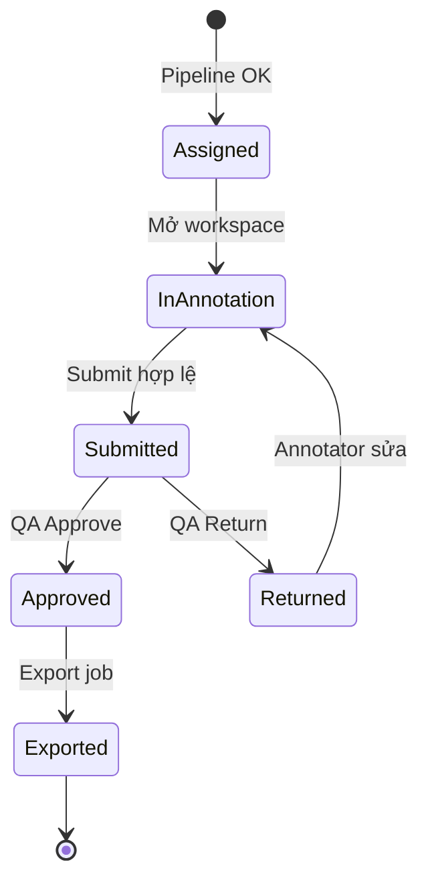
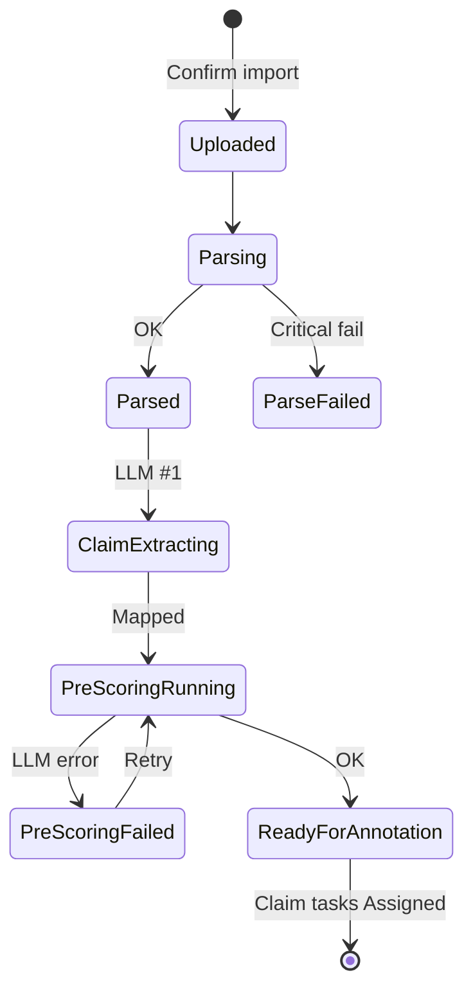

# VSF AI Annotation Platform — MVP User Stories

**Owner:** Quang  
**Phiên bản:** 1.2 (PDF-native)  
**Ngày:** 09/06/2026  
**Baseline:** `VSF_AI_Annotation_Platform_Scope_Breakdown.md` v1.2 · `docs/03_ba/dan/` · Báo cáo PM §6

---

## 1. Phân quyền & Vai trò (RBAC Baseline)

- **Admin:** Tạo project, cấu hình LLM, import PDF bundle, export, xem audit log, gán Annotator/QA trong project (**không** User Management UI đầy đủ).
- **Annotator:** Chỉ xem và làm task được giao (OQ-008).
- **QA Specialist:** Review **100%** task `Submitted` trong project được giao; Approve/Return; export CSV trong project được giao (§6.5).

---

## 2. Luồng Import PDF Bundle

### US-01: Import PDF Bundle (Admin)

- **As an** Admin,
- **I want to** upload a PDF Bundle and assign each file a role,
- **So that** the system can parse, normalize, and run the annotation pipeline.

**Acceptance Criteria:**

1. Giao diện Import cho phép upload **nhiều file PDF** và gán `file_role`: `answer_pdf` (1), `source_ref_pdf` (1), `source_content_pdf` (0..N, optional).
2. Validate theo `VR-UP-*`: PDF hợp lệ, `bundle_name` bắt buộc, đủ file role, không trùng role bắt buộc.
3. Nếu PDF scan/image → `ocr_required` → **block import** với message rõ (OQ-PDF-004).
4. **Parse preview** hiển thị: metadata answer, source list (`source_order`, `source_title`, `source_tier`), warnings (vd. `SOURCE_URL_MISSING` — không block).
5. Admin bấm **Confirm Import** → tạo `batch`, `pdf_bundle`, `parent_task`, trigger pipeline nền.
6. Audit log: `import` (user_id, bundle_id/batch_id, số file, timestamp).

### US-02: Parse & Normalize (System)

- **As the** System,
- **I want to** parse and normalize PDF content after import,
- **So that** claim extraction has structured input.

**AC:**

1. Parse Answer PDF → `answer_text_raw`, `answer_text_normalized`, metadata.
2. Parse Source Ref PDF → `source_list_extracted` (order, title, tier; `source_url` optional).
3. Parse Source Content PDF → `source_text_extract` per source; `source_parse_status` = `parsed` | `unparsed` | `ocr_required`.
4. Không extract được answer text → bundle/parent invalid (VR-PARSE-001).

### US-03: Claim Extraction — LLM bước 1 (System)

- **As the** System,
- **I want to** extract claims from normalized answer text via LLM,
- **So that** annotators work at claim level.

**AC:**

1. Sau parse/normalize, gọi **LLM bước 1** (claim extraction) qua `LLMProvider`.
2. Mỗi claim → `Claim Task` với `claim_order` từ 1; liên kết `bundle_id`, `parent_task_id`, PDF filenames.
3. Claim không map được source candidate → trạng thái `source_mapping_required` (VR-MAP-003) — **không** block vì thiếu URL.
4. Giữ `claim_text_original`; annotator có thể sửa thành `claim_text_final`.

### US-04: Pre-scoring — LLM bước 2 (System)

- **As the** System,
- **I want to** pre-score each claim across 6 Vivipedia dimensions,
- **So that** annotators see an "AI Draft" baseline.

**AC:**

1. Gọi **LLM bước 2** riêng biệt sau claim extraction (OQ-003).
2. Provider working: **Gemini 2.5 Flash** (config qua project); Mock khi chưa có API key.
3. Lưu pre-score **bất biến**; hiển thị "AI Draft" trên workspace.
4. Lỗi API/schema → `pre_scoring_failed`; Admin retry.

---

## 3. Luồng Annotator

### US-05: My Tasks queue (Annotator)

**AC:**

1. Chỉ task được giao, trạng thái `assigned` hoặc `returned`.
2. Mở task → Annotation Workspace.

### US-06: Source verification (Annotator)

- **As an** Annotator,
- **I want to** review source text extracted from PDF and confirm source status,
- **So that** scoring reflects source accessibility.

**AC:**

1. Hiển thị per source: `source_order`, `source_title`, `source_tier`, `source_text_extract`, optional `source_url` link.
2. Annotator chọn `source_access_status`: `source_text_parsed` | `inaccessible` | `unknown`.
3. `inaccessible` → `SC = 0.00` (locked) + **source_note** bắt buộc.
4. Không bắt buộc mở URL ngoài để submit (OQ-PDF-003).

### US-07: Score 6 dimensions & edit claim (Annotator)

**AC:**

1. Sửa `claim_text_final`; hiển thị pre-score "AI Draft".
2. Nhập SF, SC, NH (UI), SQ, REL, COMP — `0.00`–`1.00`, 2 decimals. Export DB dùng `hr` cho NH.
3. Composite = trung bình 6 chiều, round 2 decimals.
4. Delta ≥ ±0.20 vs pre-score → **justification_note** bắt buộc (non-empty) (OQ-004).
5. Submit khi đủ validation.

### US-08: Auto-save & Submit (Annotator)

**AC:**

1. Auto-save mỗi **30 giây** hoặc blur (DEC-UX-01).
2. Submit → `submitted` → vào QA queue (**100%**).
3. Audit: `submit`.

---

## 4. Luồng QA

### US-09: QA Queue (QA)

**AC:**

1. Hiển thị **100%** task `submitted` trong project được giao (OQ-007).
2. Không sampling, không auto-approve.

### US-10: QA Review diff & history (QA)

**AC:**

1. Hiển thị claim, sources, annotator scores, pre-score, justification notes.
2. Highlight delta ≥ ±0.20.
3. Tab history: submit/return trước đó.

### US-11: Approve / Return (QA)

**AC:**

1. **Approve** → `approved`; audit `approve`. Không sửa điểm/claim (DEC-QA-01).
2. **Return** → bắt buộc `error_category` + `qa_comment` ≥ 10 ký tự → `returned` → annotator queue; audit `return`.
3. Không nút Dispute.

---

## 5. Export

### US-12: Export CSV — Admin (Admin)

**AC:**

1. Chọn project; export chỉ claims `approved`.
2. CSV UTF-8 theo `docs/03_ba/dan/02_Import_Export_Schema.md` §10 (vd. `bundle_id`, `answer_pdf_filename`, `source_ref_pdf_filename`, `article_code`, `mapped_source_*`, `pre_*`, `ann_*`, `composite_score`, QA fields).
3. Audit `export`.

### US-13: Export CSV — QA (QA)

**AC:**

1. QA export được trong **project được giao**; không export project khác (403).
2. Cùng rule approved-only và schema §10.

---

## 6. State Machine (tham chiếu)

Chi tiết diagram: `VSF_AI_Annotation_Platform_Workflow_State_Reference_PDF_native.md` §3.

### 6.1. Claim Task

### 6.2. Parent / Bundle pipeline (system)

| State | Ý nghĩa |
|---|---|
| `source_mapping_required` | Claim chưa map source (có thể xử lý trước annotator) |
| `pre_scoring_failed` | LLM bước 2 lỗi |
| `assigned` / `submitted` / `returned` / `approved` | Claim task lifecycle |
