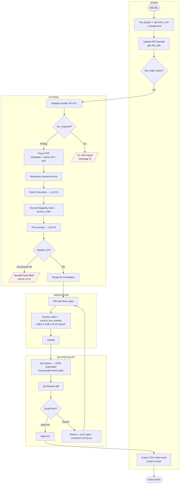
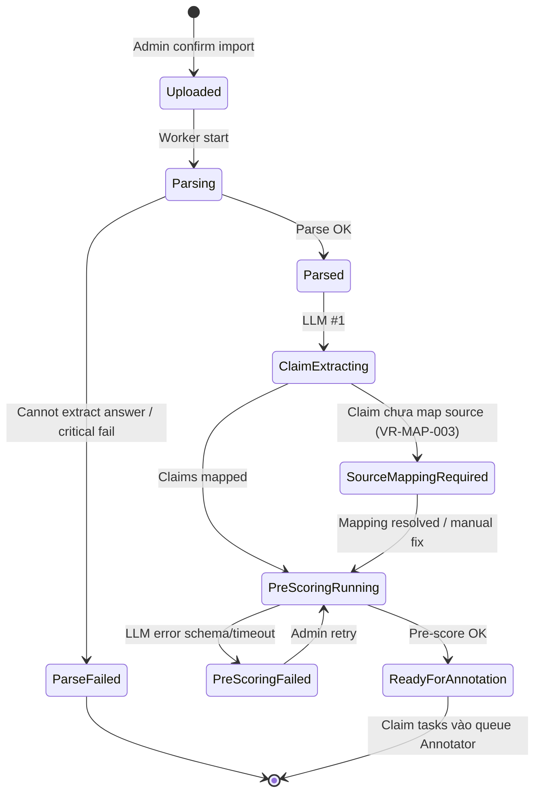
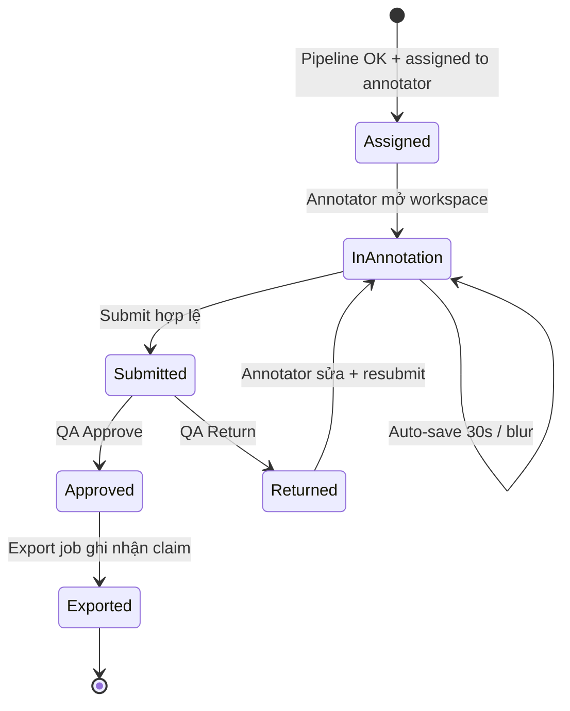

# Workflow & State Machine — Tham chiếu PDF-native MVP

**Owner:** Quang (diagram) · Tuyết (review) · Đan (validation)  
**Phiên bản:** 1.0  
**Ngày:** 09/06/2026  
**Mục đích:** Bản chuẩn text + mermaid để vẽ lại **BPMN**, **Task State Diagram**, và rà **Use Case**.

**Baseline (ưu tiên khi mâu thuẫn):**

- `Chốt Scope & Phân Công — VSF AI Annotation Platform MVP.md`
- `docs/00_project_management/Bao_cao_doi_chieu_scaffold_vs_scope_MVP.md` §6
- `docs/03_ba/dan/` (schema + `03_Validation_Rules.md`)
- `docs/03_ba/tuyet/02_Screen_Flow.md` §9

---

## 1. Pipeline End-to-End (tóm tắt)

```text
PDF Bundle Upload
  → Validate bundle (VR-UP-*)
  → Parse PDF (text + metadata + source list)
  → Normalize internal data
  → Claim Extraction (LLM bước 1)
  → Source Mapping
  → LLM Pre-scoring (LLM bước 2)
  → Annotator Review & Submit
  → QA Review 100% (Approve | Return)
  → Export CSV claim-level (Admin hoặc QA — project scope)
```

**Không có trong MVP:** CSV/JSON import · QA sampling / auto-approve · Dispute · OCR đầy đủ · Policy Center · QA sửa điểm trực tiếp.

---

## 2. BPMN — Luồng nghiệp vụ (mermaid)

> Copy sang draw.io / Figma / BPMN tool. Mỗi swimlane = 1 lane trong diagram.



### Ghi chú BPMN

| # | Quy tắc | Ref |
|---:|---|---|
| 1 | Mỗi bundle: **1 answer_pdf + 1 source_ref_pdf + ≥1 source_content_pdf** | OQ-PDF-001, VR-UP-001..003 |
| 2 | `source_url` thiếu → **warning**, không block import | OQ-PDF-003, VR-SRC-006 |
| 3 | PDF scan → `ocr_required` → **block import** | OQ-PDF-004 |
| 4 | Claim extraction và pre-scoring = **2 bước LLM** riêng | OQ-003 |
| 5 | QA review **100%** — không gateway「lấy mẫu」| OQ-007 |
| 6 | Không nhánh Dispute / Policy / auto-approve | OQ-005, §7 defer |
| 7 | Export: **Admin + QA** (chỉ project được giao), approved-only | §6.5, OQ-009 |

---

## 3. State Machine — Hai tầng

MVP có **2 lớp trạng thái** — vẽ diagram nên tách 2 swimlane hoặc 2 diagram:

1. **Bundle / Parent Task** — sau import, trước khi annotator làm việc.
2. **Claim Task** — vòng đời gán nhãn + QA.

### 3.1. Bundle / Parent Task (system pipeline)



| State | Ý nghĩa | Ai thấy |
|---|---|---|
| `Uploaded` | Bundle đã lưu, chờ parse | Admin |
| `Parsing` | Đang pdfplumber extract | Admin (progress) |
| `ParseFailed` | Không đủ dữ liệu để tiếp tục | Admin |
| `Parsed` | Có raw/normalized text + source list | System |
| `ClaimExtracting` | LLM bước 1 | System |
| `SourceMappingRequired` | Ít nhất 1 claim chưa map source | Admin (optional fix) |
| `PreScoringRunning` | LLM bước 2 | System |
| `PreScoringFailed` | LLM lỗi | Admin |
| `ReadyForAnnotation` | Claim tasks sẵn sàng | Annotator queue |

**Parse warning (không đổi state chính):** `parsed_with_warnings` — metadata/source URL missing → vẫn tiếp tục nếu không blocking.

**Import gate (trước `Uploaded`):** validate fail hoặc `ocr_required` → **không tạo bundle** (error tại màn Import).

### 3.2. Claim Task (annotator + QA)



| State | Ý nghĩa | Transition |
|---|---|---|
| `Assigned` | Chờ annotator (hoặc mới return xong) | Từ pipeline |
| `InAnnotation` | Đang làm (auto-save, không phải state DB riêng nếu đơn giản hóa) | Mở workspace |
| `Submitted` | Vào **100%** QA queue | Submit |
| `Returned` | QA trả + comment | Return |
| `Approved` | Đủ điều kiện export | Approve |
| `Exported` | Đã nằm trong file CSV export | Export job |

**Không có:** `Skipped` · `Disputed` · `QA_Edited` · auto-approve khi không sampling.

---

## 4. Use Case — Checklist cập nhật diagram

Dùng khi sửa `Use_Case_Diagram.png`:

| Actor | Use case | MVP? | Ghi chú |
|---|---|:---:|---|
| Admin | Cấu hình project + LLM + Assignment | ✅ | Không User Mgmt UI đầy đủ |
| Admin | Import PDF Bundle | ✅ | Include: validate, parse preview, confirm |
| Admin | Export CSV | ✅ | Approved-only |
| QA | Export CSV (project được giao) | ✅ | **Thêm** nếu diagram chưa có |
| Admin / System | Audit log (xem) | ✅ | Admin only |
| Annotator | Annotation Workspace | ✅ | 6 chiều, source text từ PDF |
| Annotator | Submit task | ✅ | |
| QA | QA Review | ✅ | 100% queue |
| QA | Approve / Return | ✅ | Không sửa điểm |
| System + LLM | Claim extraction | ✅ | LLM #1 |
| System + LLM | Pre-scoring | ✅ | LLM #2, baseline immutable |
| System | Auto-save 30s | ✅ | Không phải use case nghiệp vụ riêng (optional) |
| Annotator | Xem Guideline editor | ❌ | Thay bằng rubric 6 chiều hard-code trên UI |
| Any | Dispute / Sampling / Policy | ❌ | Postponed |

---

## 5. Bảng transition — Claim Task (cho Dev/Test)

| From | Event | To | Điều kiện |
|---|---|---|---|
| — | Import pipeline done | `Assigned` | Annotator được gán |
| `Assigned` | Open workspace | `InAnnotation` | RBAC |
| `InAnnotation` | Submit | `Submitted` | 6 scores, source status, ±0.20 reason |
| `Submitted` | QA Approve | `Approved` | QA role + project scope |
| `Submitted` | QA Return | `Returned` | error_type + comment ≥10 |
| `Returned` | Resubmit | `Submitted` | Validation như Submit |
| `Approved` | Export job | `Exported` | CSV §10 schema |

---

## 6. So sánh với diagram hiện tại — việc phải xóa

| Diagram cũ | Hành động |
|---|---|
| BPMN: Import JSON/CSV | **Xóa** → Import PDF Bundle |
| BPMN: Gateway「Lấy mẫu QA?」| **Xóa** |
| BPMN: Auto-approve / Spot-check | **Xóa** → QA review 100% |
| BPMN: Dispute + SLA 5d | **Xóa** |
| State: Tự động duyệt nếu không lấy mẫu | **Xóa** |
| State: Source mapping qua iframe URL | **Sửa** → `source_text_extract` + optional link |
| State/BPMN: Thiếu Parse/Normalize | **Thêm** |

---

## 7. Deliverable sau khi vẽ lại

| File | Version đích | Deadline tham chiếu |
|---|---|---|
| `VSF_AI_Annotation_Platform_Workflow_BPMN.pdf` (+ PNG export) | v1.2 PDF-native | 11/06 |
| `Task_State_Diagram.png` | v1.2 (2 tầng hoặc 2 file) | 11/06 |
| `Use_Case_Diagram.png` | v1.1 (thêm QA Export) | 11/06 |

Footer gợi ý trên mỗi diagram:

```text
VSF AI Annotation Platform MVP · PDF-native · v1.2 · 09/06/2026
Ref: Bao_cao_PM §6 · dan v0.4 · tuyet Screen Flow §9
```

---

## 8. Tham chiếu nhanh OQ đã chốt

| ID | Quyết định |
|---|---|
| OQ-001 | Input = PDF Bundle |
| OQ-PDF-001..004 | File roles · multi source PDF · text extract · block ocr_required |
| OQ-003 | 2 bước LLM |
| OQ-002 | Gemini 2.5 Flash working (LLMProvider) |
| OQ-007 | QA 100% |
| OQ-005 | No dispute |
| DEC-QA-01 | QA không sửa điểm |
| §6.5 | QA export trong project được giao |
