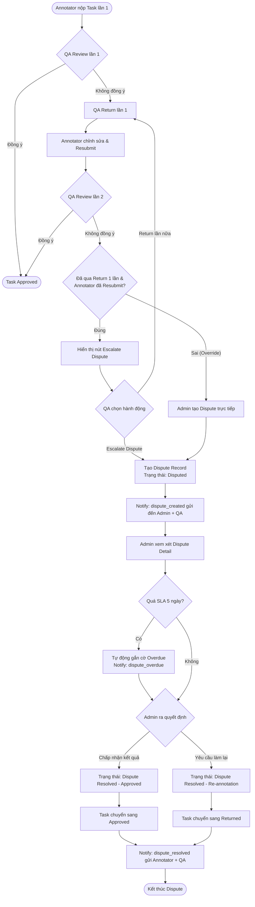
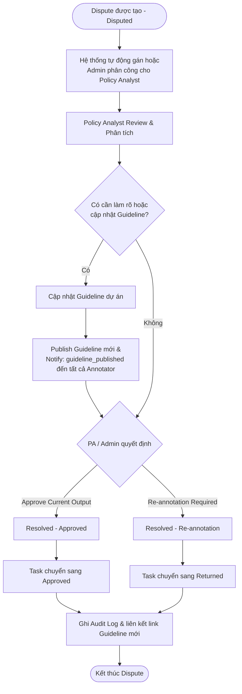

# Dispute Escalation Workflow (BPMN)

**Owner:** Quang  
**Trạng thái:** Draft for Review  
**Phạm vi:** Luồng xử lý tranh chấp Dispute (MVP và Full Flow)  
**Tài liệu tham chiếu:** `docs/03_ba/quang/sprint3/dispute_business_rules.md`

---

## 1. Luồng MVP (Sprint 3 & 4 Implementation)

Luồng MVP tối giản hóa vai trò giải quyết tranh chấp bằng cách tập trung quyền quyết định vào **Admin**. Không có sự tham gia của Policy Analyst và không liên kết trực tiếp với cập nhật Guideline trên hệ thống.

---

## 2. Luồng Full Flow (Định hướng Phase 2)

Luồng đầy đủ mở rộng vai trò xử lý tranh chấp bằng cách thêm vai trò **Policy Analyst** để đánh giá nguyên nhân gốc rễ (thường do tài liệu hướng dẫn gán nhãn - Guideline không rõ ràng). Kết quả resolve có thể trigger một quy trình cập nhật Guideline của hệ thống.

---

## 3. Các điểm khác biệt chính giữa MVP và Full Flow

| Đặc trưng | MVP Flow (Sprint 3/4) | Full Flow (Phase 2) |
| :--- | :--- | :--- |
| **Tác nhân Resolve** | **Admin** xử lý trực tiếp. | **Policy Analyst** review, Admin phê duyệt kết quả. |
| **Liên kết Guideline** | Không có (xử lý sự vụ trên từng task). | Bắt buộc liên kết mã Dispute với phiên bản Guideline cập nhật (nếu có). |
| **Quy trình Thông báo** | Chỉ gửi `dispute_created` và `dispute_resolved`. | Gửi thêm `guideline_published` yêu cầu annotator xác nhận đã đọc. |
| **Hệ thống Quản lý** | Đơn giản, lưu trạng thái task và log dispute. | Có thêm phân hệ quản lý Guideline versioning và danh sách câu hỏi FAQ. |

---

*Tài liệu nội bộ VSF — Thiết kế luồng Dispute BPMN — Owner: Quang*
